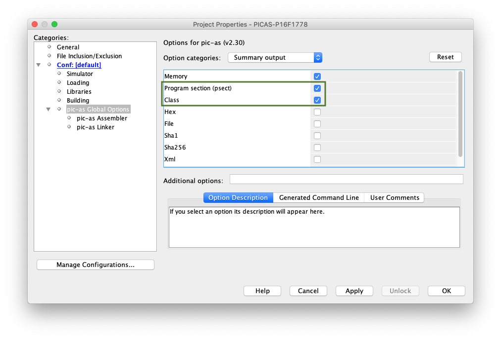
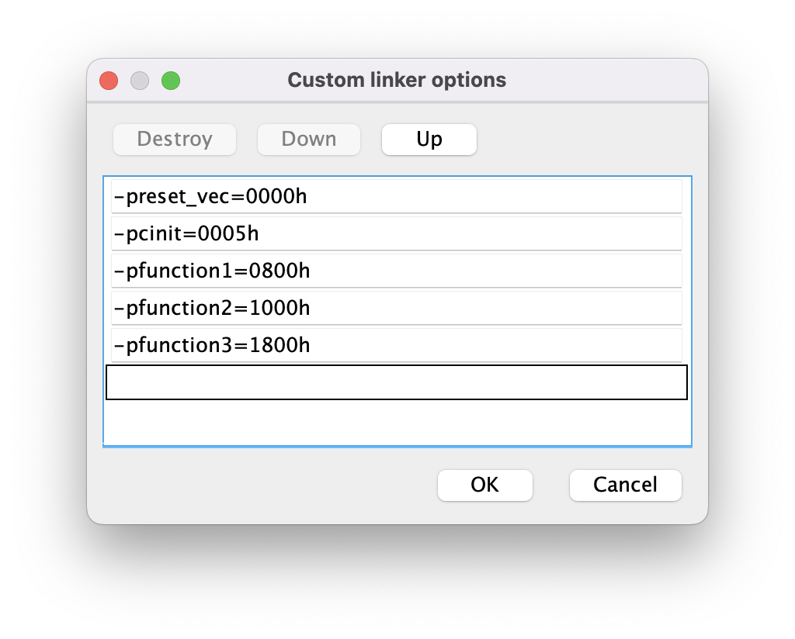

# PIC16F - Pages ACCESS.

## 0.Contents.

- [1.Configuration.](#1configuration)

- [2.Code.](#2code)

- [3.Build & Load Output.](#3build--load-output)

## 1.Configuration.

- Configure PIC-AS Summary output.

<p align="center"></p>

- Configure PIC-AS Linker Program Sector.

<p align="center"></p>

## 2.Code.

```as
; Configuration Registers.
CONFIG FOSC=INTOSC
CONFIG WDTE=OFF
CONFIG PWRTE=OFF
CONFIG MCLRE=ON
CONFIG CP=OFF
CONFIG BOREN=OFF
CONFIG CLKOUTEN=ON
CONFIG IESO=OFF
CONFIG FCMEN=OFF
CONFIG WRT=OFF
CONFIG PPS1WAY=ON
CONFIG ZCD=OFF
CONFIG PLLEN=OFF
CONFIG STVREN=ON
CONFIG BORV=LO
CONFIG LPBOR=OFF
CONFIG LVP=ON

#include <xc.inc>
; PIC16F1778 - Compile with PIC-AS(v2.36).
; PIC16F1778 - @8MHz Internal Oscillator.
; -preset_vec=0000h, -pcinit=0005h, -pfunction1=0800h, -pfunction2=1000h, -pfunction3=1800h.

;./XC8-P16F1778-TBOT-DEBUG.X/dist/default/production/XC8-P16F1778-TBOT-DEBUG.X.production.map

; GPR BANK0.
PSECT cstackBANK0,class=BANK0,space=1,delta=1
delay:   DS  1

; MCU Definitions.
; BANKS.
#define	BANK0   0x0
#define	BANK1   0x1
#define	BANK2   0x2
#define	BANK3   0x3
#define	BANK4   0x4
#define	BANK5   0x5
#define	BANK6   0x6
#define	BANK7   0x7
#define	BANK8   0x8
#define	BANK9   0x9
#define	BANK10  0xA
#define	BANK11  0xB
#define	BANK12  0xC
#define	BANK13  0xD
#define	BANK14  0xE
#define	BANK15  0xF
#define	BANK16  0x10
#define	BANK17  0x11
#define	BANK18  0x12
#define	BANK19  0x13
#define	BANK20  0x14
#define	BANK21  0x15
#define	BANK22  0x16
#define	BANK23  0x17
#define	BANK24  0x18
#define	BANK25  0x19
#define	BANK26  0x1A
#define	BANK27  0x1B
#define	BANK28  0x1C
#define	BANK29  0x1D
#define	BANK30  0x1E
#define	BANK31  0x1F
; SFR STATUS Bits.
#define	C	0x0
#define	Z	0x2

; Reset Vector.
PSECT reset_vec,class=CODE,space=0,delta=2
resetVect:
    GOTO    main

; Main.
PSECT cinit,class=CODE,space=0,delta=2
main:
    ; MCU Initialization.
    ; Internal Oscillator Settings.
    MOVLB   BANK1
    MOVLW   0b00000110
    MOVWF   OSCTUNE
    MOVLW   0x70
    MOVWF   OSCCON
    BTFSS   HFIOFR
    BRA	    $-1
    ; Ports Settings.
    ; PORT Data Register.
    MOVLB   BANK0
    MOVLW   0b00000000
    MOVWF   PORTA
    MOVLW   0b00000000
    MOVWF   PORTB
    MOVLW   0b00000000
    MOVWF   PORTC
    MOVLW   0b00000000
    MOVWF   PORTE
    ; TRIS Data Direction.
    MOVLB   BANK1
    MOVLW   0b00000000
    MOVWF   TRISA
    MOVLW   0b00000000
    MOVWF   TRISB
    MOVLW   0b00000000
    MOVWF   TRISC
    MOVLW   0b00000000
    MOVWF   TRISE
    ; LATCH Outputs.
    MOVLB   BANK2
    MOVLW   0b00000000
    MOVWF   LATA
    MOVLW   0b00000000
    MOVWF   LATB
    MOVLW   0b00000000
    MOVWF   LATC
    ; ANSEL Analog.
    MOVLB   BANK3
    MOVLW   0b00000000
    MOVWF   ANSELA
    MOVLW   0b00000000
    MOVWF   ANSELB
    MOVLW   0b00000000
    MOVWF   ANSELC
    ; WPU Weak Pull-up.
    MOVLB   BANK4
    MOVLW   0b00000000
    MOVWF   WPUA
    MOVLW   0b00000000
    MOVWF   WPUB
    MOVLW   0b00000000
    MOVWF   WPUC
    MOVLW   0b00000000
    MOVWF   WPUE
    ; ODCON Open-drain.
    MOVLB   BANK5
    MOVLW   0b00000000
    MOVWF   ODCONA
    MOVLW   0b00000000
    MOVWF   ODCONB
    MOVLW   0b00000000
    MOVWF   ODCONC
    ; SRLCON Slew Rate.
    MOVLB   BANK6
    MOVLW   0b11111111
    MOVWF   SLRCONA
    MOVLW   0b11111111
    MOVWF   SLRCONB
    MOVLW   0b11111111
    MOVWF   SLRCONC
    ; INLVL Input Level.
    MOVLB   BANK7
    MOVLW   0b00000000
    MOVWF   INLVLA
    MOVLW   0b00000000
    MOVWF   INLVLB
    MOVLW   0b00000000
    MOVWF   INLVLC
    ; HIDRVB High Drive.
    MOVLB   BANK8
    MOVLW   0b00000000
    MOVWF   HIDRVB

loop:
    MOVLP   HIGH _led_on
    CALL    LOW _led_on
    MOVLP   HIGH _led_off
    CALL    LOW _led_off
    BRA	    loop

; Function PAGE1.
PSECT function1,global,class=CODE,merge=1,delta=2
_led_on:
    MOVLB   BANK2
    BSF	    LATA, 0x6
    MOVLW   259
    MOVLP   HIGH _delay
    CALL    LOW _delay
    RETURN

; Function PAGE2.
PSECT function2,global,class=CODE,merge=1,delta=2
_led_off:
    MOVLB   BANK2
    BCF	    LATA, 0x6
    MOVLW   250
    MOVLP   HIGH _delay
    CALL    LOW _delay
    RETURN

; Function PAGE3.
PSECT function3,global,class=CODE,merge=1,delta=2
_delay:
    MOVLB   BANK0
    MOVWF   delay
    MOVLW   255
    DECFSZ  WREG, F
    BRA	    $-1
    DECFSZ  delay, F
    BRA	    $-4
    RETURN

    END	    resetVect
```

## 3.Build & Load Output.

```diff
```

---
DISCLAIMER: THIS CODE IS PROVIDED WITHOUT ANY WARRANTY OR GUARANTEES.
USERS MAY USE THIS CODE FOR DEVELOPMENT AND EXAMPLE PURPOSES ONLY.
AUTHORS ARE NOT RESPONSIBLE FOR ANY ERRORS, OMISSIONS, OR DAMAGES THAT COULD
RESULT FROM USING THIS FIRMWARE IN WHOLE OR IN PART.
